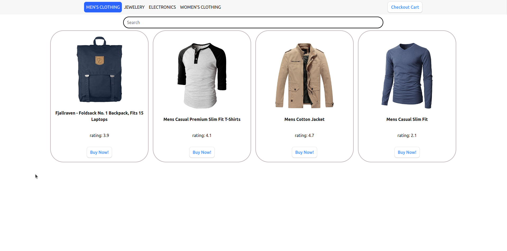
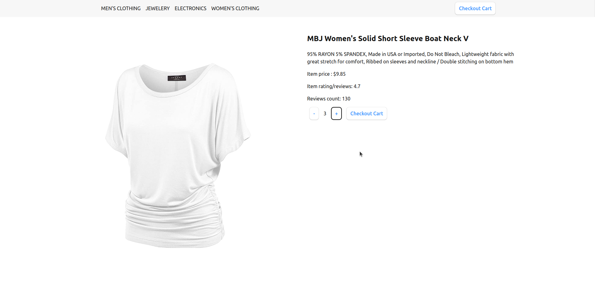
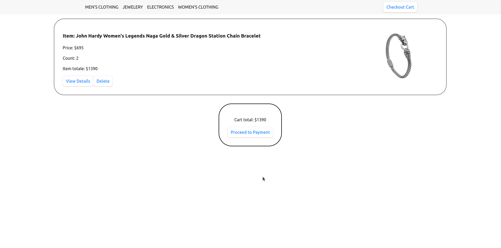

# Shop Market

Welcome to **Shop Market**, your one-stop destination for all your fashion cravings. This repository contains the frontend part of the website, built using React and React Router. Below, you'll find an overview of the project, its features, and instructions on how to get it up and running.





## Table of Contents

- [Overview](#overview)
- [Technology Stack](#technology-stack)
- [Architecture](#architecture)
- [Software Components](#software-components)
- [Installation and Usage](#installation-and-usage)
- [Contributing](#contributing)
- [License](#license)

## Overview

Shop Market is an e-commerce website where users can explore various categories of fashion items, view item details, add items to their cart, and proceed to checkout. This project's frontend is built using React and React Router for a smooth and responsive user experience.

## Technology Stack

### Frontend

- **React**: A JavaScript library for building user interfaces.

- **React Router**: A library for handling routing and navigation within a React application.

- **CSS Modules**: Used for styling components, providing local scoping of styles.

### Data Management

- **localStorage**: Utilized for client-side storage of shopping cart data and store data.

- **API Integration**: Fetch API used to interact with the [Fake Store API](https://fakestoreapi.com/products) for obtaining product data.

## Architecture

### Frontend Architecture

Shop Market's frontend follows a single-page application (SPA) architecture:

- **Components**: The UI is divided into reusable components for modularity and maintainability.

- **Routing**: React Router is used for client-side routing. It handles the rendering of components based on the URL.

- **State Management**: Component-level state is managed using React's built-in `useState`. Cart data is stored in the browser's `localStorage`.

### Data Flow

1. Initial store data is fetched from the [Fake Store API](https://fakestoreapi.com/products) and stored in `localStorage` for caching.

2. The store data is used to populate product listings and details on various pages.

3. Users can add items to their cart, and cart data is stored in `localStorage`.

4. The cart data is dynamically updated in the UI, allowing users to view, modify, and proceed to checkout.

## Software Components

### Key Components

- **HomePage**: The landing page of the website, featuring a call-to-action button to start shopping.

- **Shop**: The main shopping page with category navigation.

- **CategoryItems**: Displays items based on selected categories and allows searching within a category.

- **ItemDetail**: Shows detailed information about a selected product and handles adding/removing items from the cart.

- **Cart**: Displays the contents of the shopping cart, allows users to adjust item quantities, and proceed to checkout.

- **ShopIndex**: Provides a welcome message and category selection for an enhanced shopping experience.

### Utility Functions

Several utility functions are defined in the `store.js` file:

- Data initialization and caching.
- Functions for managing the cart.
- Filtering and retrieving product data.

## Installation and Usage

To run the Shop Market website locally, follow these steps:

1. **Clone the repository**:

   ```bash
   git clone https://github.com/your-username/shop-market.git
   ```

2. **Navigate to the project repository**:
   ```bash
   cd shop-market
   ```
3. **Install dependencies:**:
   ```bash
   npm install
   ```
4. **Start the development server:**:
   ```bash
   npm run dev
   ```

## Contributing

Contributions to Shop Market are welcome! If you'd like to contribute, follow these steps:

1. **Fork the repository**.

2. **Clone your forked repository** to your local machine.

3. **Create a new branch** for your feature or bug fix.

4. **Make your changes** and commit them with descriptive commit messages.

5. **Push your changes** to your forked repository.

6. **Create a pull request** to the original repository, explaining the changes made.

Your pull request will be reviewed, and if accepted, your contributions will be merged into the project. Thank you for helping improve Shop Market!

## License

This project is licensed under the MIT License. For more information, see the LICENSE file
